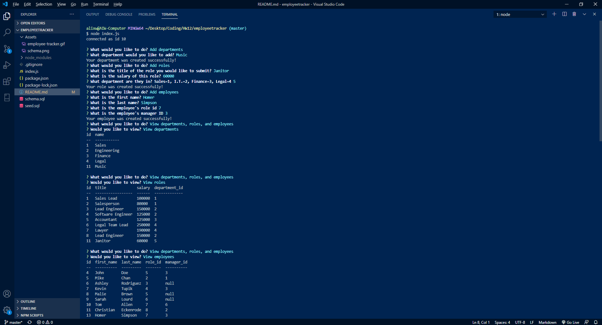
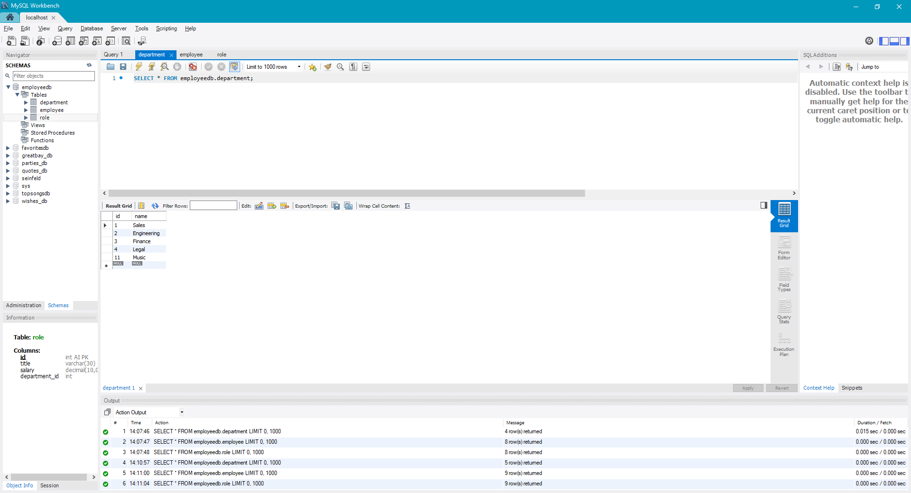
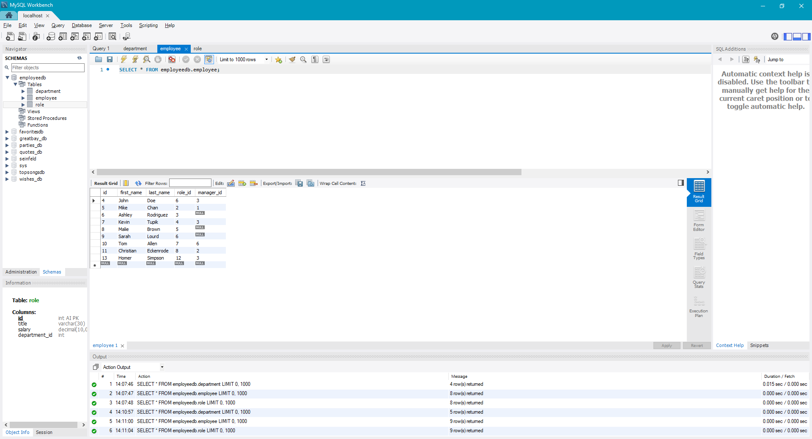
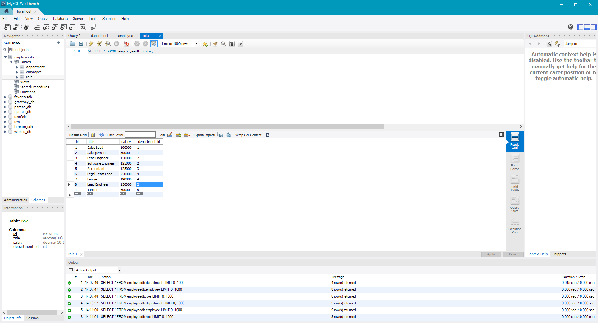

# Unit 12 MySQL Homework: Employee Tracker

## HW Description

Developers are often tasked with creating interfaces that make it easy for non-developers to view and interact with information stored in databases. Often these interfaces are known as **C**ontent **M**anagement **S**ystems. In this homework assignment, our challenge was to architect and build a solution for managing a company's employees using node, inquirer, and MySQL.

### App working example

## Installation
Run:

                npm i

## Usage

This node app uses mysql to manage employees. This app is capable of adding departments, roles, and employees. Also capable of viewing departments, roles, and employees. Lastly, it capable of updating employee roles. All this information is stored in mysql. 

## Repository

- [Project Repo](https://github.com/alixwawa/employeetracker)
